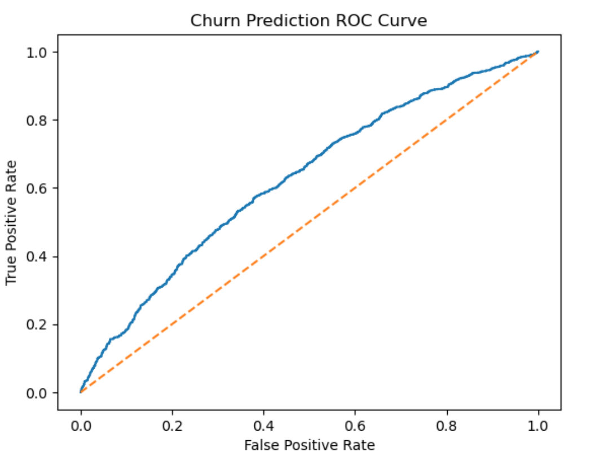
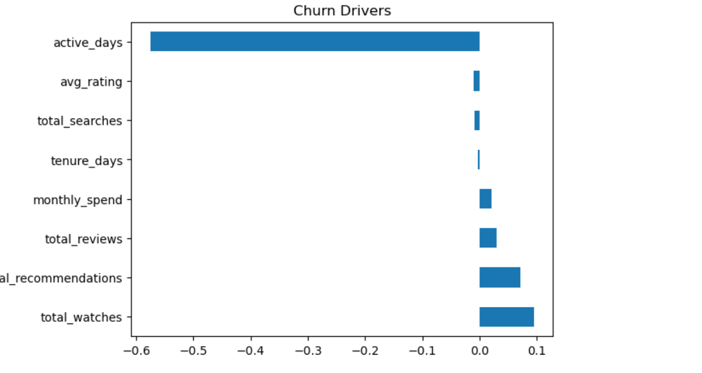

# 🎬 Subscription Churn & Retention Intelligence (Netflix/Spotify-style)

## 📌 Project Overview
This project implements an **end-to-end churn analytics and prediction pipeline** for a **subscription-based digital platform** inspired by Netflix/Spotify.

The focus is on:
- Identifying users at **high risk of churn**
- Discovering **behavioral patterns** that lead to churn
- Producing **actionable, business-ready outputs**

The project emphasizes **clarity, interpretability, and real-world relevance** over black-box modeling.

---

## 🧠 Business Problem
Subscription platforms often lose users due to **silent churn**, where engagement drops long before formal cancellation.

This project addresses:
- Early detection of churn risk
- Behavioral segmentation of users
- Data-driven retention prioritization

---

## 🗂️ Dataset Description
The dataset simulates a real streaming platform with multiple relational tables:

- `users` – subscription and demographic information  
- `watch_history` – content consumption behavior  
- `search_logs` – intent and discovery signals  
- `reviews` – satisfaction indicators  
- `recommendation_logs` – recommendation exposure  

All tables are linked via `user_id`, mirroring real production databases.

---

## 🏗️ Project Architecture
Raw CSV Files
     ↓
SQLite Database (Relational Tables)
     ↓
SQL Aggregations & Joins
     ↓
User-Level Master Dataset
     ↓
Data Cleaning (Business + ML-assisted)
     ↓
Pattern Recognition (Clustering)
     ↓
Churn Prediction & Risk Scoring
     ↓
ML Output Dataset (for BI / decision-making)

---

## ⚙️ Phase 1: Database & Data Engineering
**Tools:** SQLite, SQL, Pandas

- Loaded multiple relational tables into SQLite (Mac-friendly, no setup overhead)
- Used SQL joins and aggregations to summarize user behavior
- Created a clean **user-level master dataset** for ML analysis

**Notebook:** `00_data_overview.ipynb`

---

## 🤖 Phase 2: Machine Learning (Churn + Pattern Recognition)
**Tools:** Python, Pandas, scikit-learn

### 🔹 Data Cleaning
- Business-aware handling of missing values
- ML-assisted anomaly detection using Isolation Forest
- Robust preprocessing of behavioral data

### 🔹 Churn Definition
Churn is defined as:

> **No watch activity in the last 60 days**

This represents **behavioral churn**, a leading indicator used in subscription platforms.

---

### 🔹 Pattern Recognition (PR)
- Engineered behavioral features capturing engagement, satisfaction, and tenure
- Applied K-Means clustering to identify natural user segments
- Translated clusters into business-friendly behavioral personas

---

### 🔹 Churn Prediction & Risk Scoring
- Trained an interpretable Logistic Regression model
- Evaluated using ROC-AUC and confusion matrix
- Converted churn probabilities into **Low / Medium / High risk categories**

**Notebook:** `01_ml_churn_pr.ipynb`

---

## 📊 ML Results & Visualizations

### ROC Curve – Churn Prediction Performance

### Feature Importance – Key Churn Drivers

### Churn Rate by Behavioral Segment

---

## 📁 Repository Structure
subscription-churn-analytics/
│
├── notebooks/
│   ├── 00_data_overview.ipynb      # SQL + database creation
│   ├── 01_ml_churn_pr.ipynb        # Cleaning, PR, churn prediction
│
├── data/
│   ├── user_level_master.csv       # Output of database phase
│   ├── user_level_ml_output.csv    # Final ML output
│
├── screenshots/
│   ├── roc_curve.png               # Model evaluation
│   ├── feature_importance.png      # Churn drivers
│   ├── churn_by_segment.png        # PR validation
│
├── README.md

---

## 🚀 Skills Demonstrated
- SQL (Joins, Aggregations, Relational Modeling)
- Data Cleaning & Feature Engineering
- Pattern Recognition (Clustering)
- Churn Prediction (Supervised ML)
- Explainable ML & Business Translation
- End-to-End Analytics Pipeline Design

---

## 💡 Key Takeaway
This project demonstrates how **machine learning can be applied to real subscription businesses** to predict churn, understand user behavior, and support retention decisions in an **interpretable and actionable way**.
---

## 📊 Interactive BI Dashboard (Tableau)

The machine learning outputs from this project were integrated into an interactive Tableau dashboard to enable business-focused exploration of churn drivers, user behavior, and retention insights.

🔗 **View the Tableau Dashboard:**  
https://public.tableau.com/views/Netflix-CustomerChurnEngagementAnalysisDashboard/Dashboard1?:language=en-US&:sid=&:redirect=auth&:display_count=n&:origin=viz_share_link

The dashboard provides:
- Executive KPIs (Total Users, Churn Rate, High-Risk Users)
- Churn trends over time
- Geographic churn distribution
- Churn by subscription plan
- Behavioral risk segmentation
- Engagement and spend vs churn analysis

This dashboard is designed for **non-technical stakeholders**, translating ML outputs into actionable, decision-ready insights.

